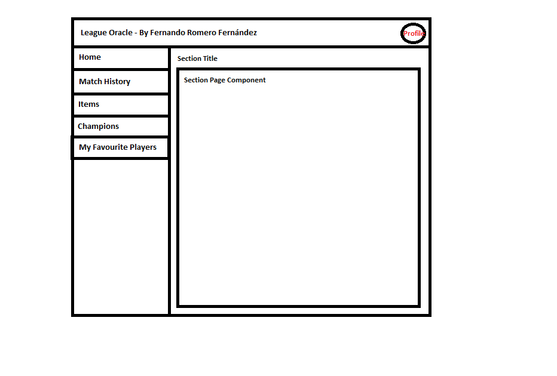
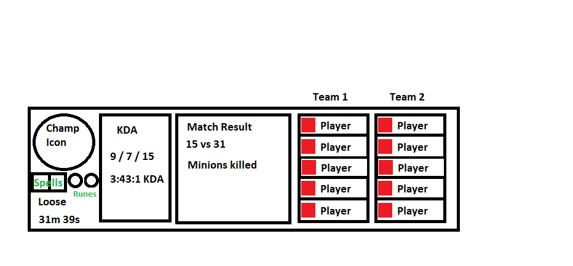

# LeagueOracle
To develop an app that allows you to check out your statistics from League of Legends Game.

# RoadMap
- [ ] Register Users.
- [ ] Login.
- [X] Match History of a Summoner.
    - [X] Match Card. Has 2 Teams Cards and 1 Info Card.
    - [X] Info Card. Contains match data. 
    - [X] Team Card. Has 5 Player Cards.
    - [X] Player Card. Contains Champion used and Summoner Name.
- [ ] User Profile. (MYSQL Data)
- [ ] Summoner Profile. (In-Game Data)
    - [ ] Most Played Champions.
    - [ ] Ranked Status.
- [ ] CRUD favourites players.
    - [ ] Check my favourite players.
    - [ ] Add a player to my favourites.
    - [ ] Remove a player from my favourites.
- [X] In-Game Items page.
    - [X] List Items.
    - [ ] Detail Page Item.
- [X] In-Game Champions page.
    - [X] List Champions.
    - [ ] Detail Page Champion.
- [ ] In-Game Free Champions of Week page.
    - [ ] List Champions.
    - [ ] Detail Page Champion.
- [ ] Live Match.
- [ ] CI/CD Conf.

# Dashboard

# Match Card

